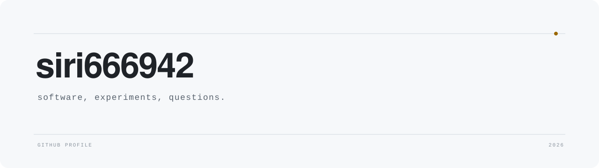

<picture>
  <source media="(prefers-color-scheme: dark)" srcset="assets/profile-dark.svg">
  <source media="(prefers-color-scheme: light)" srcset="assets/profile-light.svg">
  
</picture>

I like projects that start with a practical question and eventually force me to understand what is happening underneath.

### Things I've made

- [coding-agent](https://github.com/siri666942/coding-agent) — a Python coding-agent harness with tool execution, Docker isolation, memory, scheduled work, tracing, and evaluation.
- [my_rag](https://github.com/siri666942/my_rag) — a multi-turn retrieval system with hybrid search, reranking, streaming responses, and server-side sessions.
- [echopet](https://github.com/siri666942/echopet) — a local-first desktop companion that turns voice and context into music recommendations from a local library.

### These days

Reading database internals, tracing on-chain money flows, and trying to make increasingly complicated software feel less mysterious.
