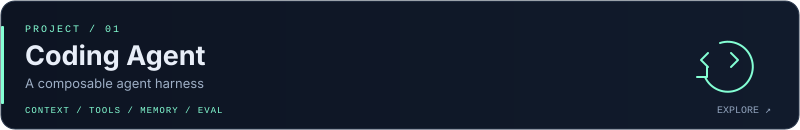
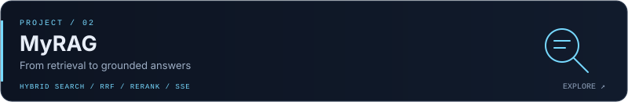
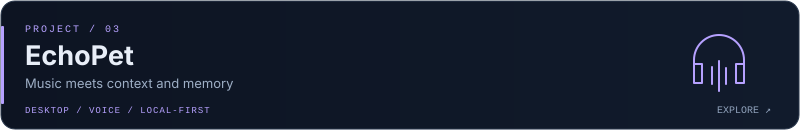
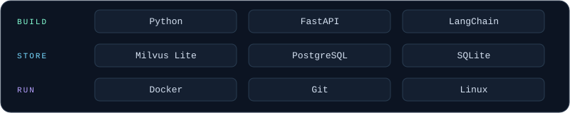

<div align="center">



</div>

<br>

## `01` / Hello, world

我是 **Siri**，一名在 BUPT 学习、持续动手做项目的学生。最近主要探索 **Coding Agent、RAG 和 AI 应用工程**。

我喜欢沿着一个问题往下挖：从模型调用到工具执行，从检索质量到并发与状态管理，再到数据库、操作系统和网络。让 Demo 跑起来之后，还想知道它为什么这样工作、会在哪里失败、怎样验证改动有效。

```python
class Siri:
    focus = ["Coding Agents", "RAG", "AI Applications"]
    approach = "build → understand → measure → iterate"
    curiosity = float("inf")
```

<a name="projects"></a>

## `02` / Selected builds

[](https://github.com/siri666942/coding-agent)

从模型与工具的循环出发，把 **Context、Memory、MCP、后台任务和 Cron** 组织成统一的 Python Harness。探索 Docker 执行沙箱、权限边界、运行轨迹和评估机制。

`Python` `Tool Calling` `MCP` `Docker` `Evaluation`

[](https://github.com/siri666942/my_rag)

基于 **FastAPI + LangChain + Milvus Lite** 构建 RAG 系统：向量与自实现 BM25 双路召回、RRF 融合、Rerank 精排，以及 SSE 流式输出和服务端会话管理。

`Hybrid Retrieval` `BM25` `RRF` `Reranking` `SSE`

[](https://github.com/siri666942/echopet)

把桌宠、语音输入、环境上下文、长期记忆和本地曲库推荐连接起来。探索 **本地优先的情绪音乐 Agent**，让 AI 通过更自然的交互进入日常生活。

`FastAPI` `PySide6` `faster-whisper` `Embeddings` `Local-first`

<a name="now"></a>

## `03` / Current focus

| 正在深入 | 想弄清楚的问题 |
| :--- | :--- |
| **Agent Runtime** | 工具循环、上下文压缩、长期记忆和后台任务怎样协同？ |
| **Evaluation & Reliability** | 怎样用任务结果、轨迹、延迟和消融实验验证改动？ |
| **Retrieval Systems** | 怎样让召回、融合和重排更好地服务多轮问答？ |
| **CS Foundations** | 数据库、并发、操作系统和网络如何支撑上层应用？ |

<a name="toolkit"></a>

## `04` / Toolkit



主要在项目中使用 **Python / FastAPI**，围绕 Agent 和 RAG 学习检索、会话管理、工具执行与部署；同时继续补齐数据库和系统基础。

<a name="learning"></a>

## `05` / Learning in public

- [**Database Lab**](https://github.com/siri666942/db_learning_7days) — PostgreSQL、Docker、数据写入、视图与权限实验。
- [**CSAPP Learning Route**](https://github.com/siri666942/csapp-learning-route) — 用代码理解计算机系统。
- [**RAG Learning**](https://github.com/siri666942/rag-learning) — 检索增强生成的学习与实践记录。

<br>

<div align="center">


**从一个能跑的想法，到一个经得起追问的实现。**

</div>
